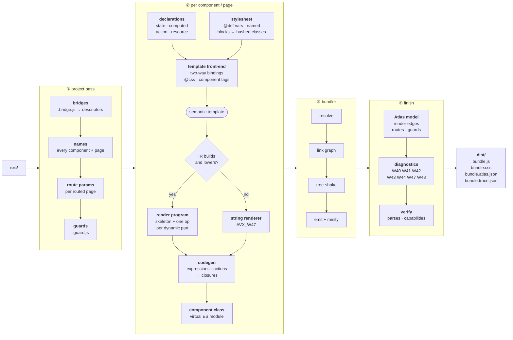

<div align="center">


# Avenx.js

**A frontend framework that can explain itself.**

Single-file components, compiled templates, and a compiler that keeps a model of your whole application —<br/>so you can ask it what a change will break before you make it.

[](https://www.npmjs.com/package/avenx-core) [](https://docs.avenx-js.com/) [](#-whats-in-the-box) [](https://nodejs.org) [](LICENSE) [](CONTRIBUTORS.md)

<samp>

[**Documentation**](https://docs.avenx-js.com/) &nbsp;·&nbsp; [**Quick start**](#-quick-start) &nbsp;·&nbsp; [**Why Avenx**](#-why-avenx-is-different) &nbsp;·&nbsp; [**CLI**](#-cli-reference) &nbsp;·&nbsp; [**Contributing**](#-contributing)

</samp>

</div>

---

## 🧭 What Avenx is

Avenx-JS is a compiler-first frontend framework. You write a component as one
file — declarations and markup together — and the compiler turns it into a
render program: a static HTML skeleton plus one binding per dynamic part. There
is no virtual DOM, and there is no expression interpreter in your production
bundle, because every expression was compiled to a JavaScript function at build
time.

> [!TIP]
> What is unusual is what the compiler does with what it learns. It keeps a
> **semantic model of the whole application** — every state key, computed
> value, action, template binding, route and guard, and the relationships
> between them — and exposes it as a tool you can query from the command line.

The whole build, end to end:



Two things in there are worth pointing at. The **semantic template** is the fork:
the render program is compiled from the template as you wrote it, before any
directive has been rewritten into markup, because `<@for item in items>` still
says what it means at that stage and afterwards it does not. And **nothing is
written until everything is produced** — the bundle is checked for parseability
and for the runtime capabilities the build decided to link, staged, and only
then promoted, so a failure never leaves a new script beside a stale stylesheet.

<table>
<tr>
<th align="left" width="50%">🧑‍💻 You write a component…</th>
<th align="left" width="50%">⚙️ …the compiler emits this</th>
</tr>
<tr valign="top">
<td>

```html
<state name="World" />

<action name="shout">
  name = name.toUpperCase();
</action>

<div @css card>
  <h1>Hello, {{ name }}!</h1>
  <button @click="shout()">Shout</button>
</div>
```

</td>
<td>

```js
// skeleton — parsed once per class
html: '<div class="avenx-a050b589">
         <h1>Hello, <!--axt:0-->!</h1>
         <button data-axb="0">Shout</button>
       </div>'

// one op per dynamic part
ops: [ { k: 'text',  t: 0, x: 0 },
       { k: 'event', e: 0, n: 'click' } ]

// compiled at build time
exprs: [ ($s) => axGet($s, 'name') ]
stmts: [ ($s) => axCall(…, 'shout') ]
```

</td>
</tr>
</table>

No imports, no `setState`, no hooks, no build configuration — and nothing left
to interpret at run time. That right-hand column is real output, lightly wrapped
to fit: `{{ name }}` became a comment marker plus one `text` op, the handler
became a `data-axb` hook plus one `event` op, and both expressions became
ordinary JavaScript functions. The matching `.component.css` holds styles scoped
to this component and nothing else.

> [!IMPORTANT]
> **Avenx is pre-1.0 and under active development.** The latest published
> release is `0.4.3`; a production-readiness cycle is in progress ahead of a
> release candidate. See [Project status](#-project-status) for what that
> means in practice.

<div align="right"><a href="#avenxjs">↑ back to top</a></div>

---

## ✨ Why Avenx is different

Most of what a framework offers is table stakes: components, reactivity,
routing, scoped styles. Avenx has those. These four are the reasons to look at
it instead of something else.

<table>
<tr align="center" valign="top">
<td width="25%">
<br/>🔭<br/><br/>
<b><a href="#-atlas--ask-the-compiler-what-a-change-will-break">Atlas</a></b>
<br/><br/>
<sub>Ask what a change will break —<br/>and see where the analysis stopped.</sub>
<br/><br/>
</td>
<td width="25%">
<br/>🔍<br/><br/>
<b><a href="#-trace--record-why-a-bug-happened-then-replay-it">Trace</a></b>
<br/><br/>
<sub>Record why a bug happened,<br/>then replay it as a test.</sub>
<br/><br/>
</td>
<td width="25%">
<br/>🔄<br/><br/>
<b><a href="#-rewind--optimistic-updates-that-undo-themselves">Rewind</a></b>
<br/><br/>
<sub>Actions that undo their writes —<br/>and warn what they cannot.</sub>
<br/><br/>
</td>
<td width="25%">
<br/>🔒<br/><br/>
<b><a href="#-compiled-expressions--no-eval-no-new-function">Compiled</a></b>
<br/><br/>
<sub>No <code>eval</code>, no interpreter.<br/>Runs under <code>script-src 'self'</code>.</sub>
<br/><br/>
</td>
</tr>
</table>

<br/>

### 🔭 Atlas — ask the compiler what a change will break

`avenx impact` and `avenx why` answer data-flow questions about your own code.
This is real output from a small store application — a bridge holding
`items`, a getter that sums them, and a page that reads it:

```console
$ npx avenx impact cart.items

What depends on: cart.items
   state  src/global/cart.bridge.js:5

├─ reads cart.count .reduce  src/global/cart.bridge.js:9
│  └─ reads Home {{ }} "cart.count"  src/pages/home.page.js:6
└─ writes cart.add  src/global/cart.bridge.js:17
   └─ invokes Home @click="cart.add(product.id)"  src/pages/home.page.js:12
      └─ declares Home  src/pages/home.page.js
         ├─ routes-to /  src/main.app.js:9
         └─ routes-to *  src/main.app.js:11

7 related nodes

1 unresolved relationship — this answer may be incomplete:
  ? spread  ...  src/global/cart.bridge.js:17
```

> [!NOTE]
> Note how that output ends. This is a data-flow map, not a module graph, and
> it tells you where its own analysis stopped instead of quietly presenting a
> partial answer as a complete one. Every answer prints that count, including
> when it is zero.

The same model produces build-time diagnostics — a state key nothing reads, an
action nothing invokes — and both refuse to fire when the analysis behind them
was incomplete. Atlas runs at compile time only: `avenx build` writes
`dist/bundle.atlas.json` beside the bundle and the runtime never reads it.

**→ [Atlas guide](https://docs.avenx-js.com/core-concepts/atlas/)**

<sub><a href="#-why-avenx-is-different">↑ back to features</a></sub>

<br/>

### 🔍 Trace — record why a bug happened, then replay it

Serve with `--trace`, reproduce the behaviour, and read back the causal chain
from the event to the DOM write. Real output from the same application:

```console
$ npx avenx trace view latest

Trace trace-3b96  ·  6 nodes  ·  recorded 2026-09-21T19:32:48.861Z
  http://localhost:4700/

▸ click <button> Home
  └─ bridge cart · add("a")
     ├─ write items [0 items] → [1 item]
     │  └─ woke text cart.count
     │     └─ patched <h1> text "0" → "1"
     └─ emit cart:added → 0 listeners

Determinism: deterministic — this trace can be exported as a regression test.
```

`avenx trace export latest --out test/cart-add.test.js` turns that recording
into a test. The generated test calls `replay()`, which drives the recorded
inputs back through the real framework and compares **every** state and DOM
change against the recording, so a regression reports its cause rather than a
bare mismatch. The convenience assertions it writes alongside are a starting
point the file tells you to prune.

Recording is opt-in, development-only, and absent from production bundles —
with tracing off, each instrumented site is one boolean check.

**→ [Trace guide](https://docs.avenx-js.com/core-concepts/trace/)**

<sub><a href="#-why-avenx-is-different">↑ back to features</a></sub>

<br/>

### 🔄 Rewind — optimistic updates that undo themselves

Mark an action `atomic` and every state write it makes is journaled. If it
throws, or returns a promise that rejects, the journal is played backwards:
component state, bridge state, nested properties, array and `Map`/`Set`
mutations, and keys the action created or deleted all come back. Because the
restore goes through the same reactive machinery as an ordinary write, the DOM
corrects itself.

```html
<action name="incQty" atomic>
  busy = true;
  cart.addQty(props.id, 1);
  return api.setQty(props.id, qty);
</action>
```

A library can do that much. What a library cannot do is tell you at build time
which of an action's effects a rewind will **not** undo:

```console
$ npx avenx build

[AVX_W43] session.save is atomic, but 2 effect(s) cannot be rewound:
  storage localStorage.setItem(  src/global/session.bridge.js:8
  emit emit('saved'  src/global/session.bridge.js:9
Everything it writes through Avenx state will be restored; the effects above
will not. Move them after the transaction, or accept that a rewind leaves them
in place.
```

When the analysis cannot resolve an action's write set it says so (`AVX_W42`)
and marks its own effect list as incomplete, rather than reporting a shorter
list as if it were the whole one.

**→ [Rewind guide](https://docs.avenx-js.com/core-concepts/rewind/)**

<sub><a href="#-why-avenx-is-different">↑ back to features</a></sub>

<br/>

### 🔒 Compiled expressions — no `eval`, no `new Function`

Every interpolation, computed value, directive binding, inline handler and
`<action>` body is compiled to an ordinary JavaScript function at build time and
linked into the bundle:

```text
count * 2                ->  ($s) => (axGet($s, "count") * 2)
if (!text) { return; }   ->  ($s) => { if (!axGet($s, "text")) { return; } … }
```

A production bundle therefore contains no `eval`, no `new Function` and no
`with`, and runs under `script-src 'self'` with no `unsafe-eval` and no
`unsafe-inline`. The build's own test suite asserts this against the emitted
bundle. A development build still carries the interpreter so a half-finished
template keeps rendering; `AVX_W48` names anything it could not compile.

**→ [Template expressions](https://docs.avenx-js.com/core-concepts/template-expressions/)** ·
**[Deployment](https://docs.avenx-js.com/guides/deployment/)**

<div align="right"><a href="#avenxjs">↑ back to top</a></div>

---

## 🚀 Quick start

> [!NOTE]
> Requires **Node.js 18 or newer**. There is no `avenx` package on npm — the
> package is `avenx-core`, and it provides the `avenx` binary, so install it
> before using `npx avenx`.

<table>
<tr valign="top">
<td width="47%">

```bash
mkdir my-app && cd my-app
npm install avenx-core

npx avenx init        # scaffold
npx avenx g counter   # a working component
npx avenx serve       # http://localhost:3000
```

`init` scaffolds the project. `g counter` generates a component **and registers
it** in `src/main.app.js`. `serve` builds and starts a dev server with live
reload — add `--open` to launch a browser.

You have a running application before writing a line of code.

</td>
<td width="53%">

```text
my-app/
├── src/
│   ├── components/counter/
│   │   ├── counter.component.js  # template
│   │   └── counter.component.css # scoped styles
│   ├── pages/        # routed pages
│   ├── global/       # bridges, shared styles
│   ├── guards/       # route guards
│   └── main.app.js   # entry, registration, routes
├── .vscode/          # editor support
├── avenx.config.json
├── index.html
├── package.json
└── dist/             # build output (generated)
```

</td>
</tr>
</table>

### Write a component

Open `src/components/counter/counter.component.js`:

```html
<state count="0" label="Clicks" />

<computed name="doubled" value="count * 2" />

<action name="increment"> count++; </action>
<action name="reset"> count = 0; </action>

<div @css card>
  <h1 @css title>{{ label }}: {{ count }}</h1>
  <p>Doubled: {{ doubled }}</p>

  <@if (count > 0)>
    <button @css btn @click="reset()">Reset</button>
  <@else>
    <p @css hint>Press the button to start.</p>
  </@if>

  <button @css btn @click="increment()">+1</button>
</div>
```

And `counter.component.css`. A `<@css>` block contains **named blocks**, not
selectors: `card { … }` declares a block that the template attaches with
`@css card`. Nothing is matched by class name, so an element with no `@css`
directive is unstyled.

```css
<@global>
    @def brand #6366f1;
</@global>

<@css>
    card {
        font-family: system-ui, sans-serif;
        max-width: 20rem;
        margin: 3rem auto;
        padding: 2rem;
        border-radius: 12px;
        background: #f9fafb;
        text-align: center;
    }

    title { color: #1e1b4b; }
    hint  { color: #9ca3af; font-size: 0.85rem; }

    btn {
        background: @brand;
        color: white;
        border: none;
        border-radius: 6px;
        padding: 0.5rem 1rem;
        margin: 0.25rem;
        cursor: pointer;
    }
</@css>
```

Save the file and the browser updates. The counter increments, the computed
value follows it, the `<@if>` arm switches when the count leaves zero, and the
styles reach this component and nothing else.

### Ship it

```bash
npx avenx check    # validate every template binding; exits 1 on any warning
npx avenx build    # production build into dist/
```

**→ [Full quick start](https://docs.avenx-js.com/getting-started/quickstart/)** ·
**[Project structure](https://docs.avenx-js.com/getting-started/structure/)**

<div align="right"><a href="#avenxjs">↑ back to top</a></div>

---

## 📖 A tour of the syntax

### Component anatomy

A component is two files in one directory: `<name>.component.js` (declarations
and markup) and `<name>.component.css` (scoped styles). Pages are the same, as
`<name>.page.js` / `<name>.page.css`, and live in `src/pages/`.

| Declaration | Purpose |
| :--- | :--- |
| `<state count="0" title="Home" />` | Reactive local state. Values are coerced: numbers, booleans, JSON and JavaScript literals. |
| `<computed name="x" value="a * 2" />` | A derived value, re-evaluated when what it reads changes. |
| `<action name="go"> … </action>` | A method. The body is ordinary JavaScript. Add `atomic` to make its writes undoable. |
| `<resource name="users"> … </resource>` | A declarative async read, usable with `<@suspense>`. |

State is reachable bare (`count`) or through its root (`state.count`); both
resolve to the same value.

### Templates

| Syntax | What it does |
| :--- | :--- |
| `{{ expr }}` | Interpolation, HTML-escaped. |
| `{{{ expr }}}` | Raw HTML. Never give it untrusted input. |
| `<@if cond>` / `<@elseif>` / `<@else>` / `</@if>` | Conditional blocks. Bracket a top-level comparison: `<@if (n > 3)>`. |
| `<@for item in list key="item.id">` / `<@empty>` | Keyed lists over arrays, objects, `Map`, `Set` or a number. `index` is always bound. |
| `<Child prop="{{ value }}" />` | A child component. Also `data-props-name="expr"`. |
| `<slot>` / `<slot name="x">` | Transclusion, with fallback content. |
| `@click="handler()"` | Event binding, with `.prevent`, `.stop`, `.self`, `.once`, `.passive` and key modifiers. |
| `data-ax-bind="state.x"` | Two-way binding for inputs, textareas, selects, checkboxes and radios. |
| `data-ax-show` / `data-ax-class` / `data-ax-style` / `data-ax-html` | Reactive visibility, classes, inline styles and HTML. |
| `:[nameExpr]="valueExpr"` | An attribute whose **name** is computed. Both slots are expressions. |
| `<@defer>` | Render a block on idle, on a timer, on interaction or when visible. |

### Shared state with Bridges

A **Bridge** is a module holding state several components need, plus the actions
that change it. You create one with `bridge()` and use it by importing it —
there is no provider, no hook and no subscription to clean up.

```javascript
// src/global/cart.bridge.js
import { bridge } from 'avenx-core/runtime';

export default bridge({
  state: {
    items: [],
  },

  get count() {
    return this.items.reduce((n, item) => n + item.qty, 0);
  },

  add(id) {
    const existing = this.items.find((item) => item.id === id);
    this.items = existing
      ? this.items.map((item) => (item.id === id ? { ...item, qty: item.qty + 1 } : item))
      : [...this.items, { id, qty: 1 }];
    this.emit('added', id);
  },
});
```

```html
<!-- src/pages/home.page.js -->
import cart from '../global/cart.bridge.js';

<div>
  <h1>Cart: {{ cart.count }}</h1>
  <button @click="cart.add('keyboard')">Add</button>
</div>
```

Because the import *is* the connection, the compiler sees every consumer: unused
bridges are left out of the bundle, and a mistyped member or an unemitted event
name is reported at build time. State is read-only outside the bridge, so every
mutation has one traceable origin.

**→ [Bridges](https://docs.avenx-js.com/core-concepts/bridges/)**

### Pages, routing and guards

Pages in `src/pages/` are registered by the compiler. You map them to routes in
`src/main.app.js`:

```javascript
import { AvenxApp } from 'avenx-core/runtime';
import UserCard from './components/user-card/user-card.component.js';

const app = new AvenxApp({ target: '#app' });

app.register('UserCard', UserCard);

app.initRouter({
  '/': 'Home',
  '/profile/:userId': 'Profile',
  '*': 'Home',
});
```

Route parameters land in the page's state, so `/profile/42` makes `{{ userId }}`
render `42`. Query strings are parsed into `state.query` with type coercion, `*`
is a catch-all, and a route can carry `keepAlive` to cache the page instance or
`guards` to gate navigation.

**→ [Routing](https://docs.avenx-js.com/core-concepts/routing/)** ·
**[Routing tutorial](https://docs.avenx-js.com/getting-started/routing-tutorial/)**

<div align="right"><a href="#avenxjs">↑ back to top</a></div>

---

## 📦 What's in the box

Everything listed here is implemented and usable today. What differs is how a
construct **renders**, which is worth knowing because it has a cost.

Templates compile to a render program: a skeleton parsed once per component
class, with one reactive effect per binding, so an update touches only the
bindings whose dependencies changed. A template using a construct the compiler
cannot yet model renders through the older string renderer instead — it renders
correctly, but re-renders and diffs the whole template on every update. The
build says which and why (`AVX_W47`), and there is no partial mode: a template
is compiled entirely or not at all.

<br/>

**⚡ Compiled** — an update touches only the bindings whose dependencies changed.

| | |
| :--- | :--- |
| Components, pages, props | slots, named + fallback |
| Nested components, any depth | bounded at 50 levels, `AVX_R36` |
| State, computed values, actions | watchers, lifecycle hooks |
| `<@if>` / `<@elseif>` / `<@else>` | keyed `<@for>` / `<@empty>` |
| Events and modifiers | two-way binding, boolean attributes |
| `data-ax-show` / `-class` / `-style` / `-html` | `<@defer>`, `<resource>` declarations |

**🧱 No rendering cost of their own** — these are not template constructs.

| | |
| :--- | :--- |
| Scoped CSS, `<@global>` `@def` variables | Sass / SCSS / Less / PostCSS |
| Bridges, provide & inject | atomic actions (Rewind) |
| Router: params, query, wildcards | guards, keep-alive, history, prefixes |
| Atlas — `atlas` / `impact` / `why` | Trace, diagnostics catalogue *(compile-time)* |

**🐢 Available, but through the string renderer** — correct, and re-rendered whole on every update.

| | |
| :--- | :--- |
| `<@suspense>` and `<@errorBoundary>` | transitions, template refs |
| Virtualised lists, form validation | dynamic component tags |
| Dynamic attribute names, router view | `<@deadlock>` boundary ⚠️ *(see below)* |

> [!WARNING]
> **`<@deadlock>` is the one qualified entry.** Scheduler and watcher guards do
> detect runaway reactive work and log `AVX_R18`, and you can trip a boundary
> manually with `$tripDeadlockBoundary(name, error)` — but detection does not
> automatically trip the nearest boundary, and the `maxDepth`, `action` and
> `isolated` attributes are currently metadata rather than active controls. The
> [deadlock guide](https://docs.avenx-js.com/core-concepts/deadlock/) states the
> current behaviour and its limits.

### Size and dependencies

The published package has **one dependency**, `acorn`, used only by the
compiler; it does not appear in an application bundle. The runtime you ship has
no third-party dependencies.

A freshly scaffolded application, production build, measured with `avenx build`:

| Asset | Raw | Gzipped |
| :--- | ---: | ---: |
| `bundle.js` | 341 KB | 78 KB |
| `bundle.css` | 0.7 KB | 0.3 KB |

That number is honest rather than flattering, and worth understanding: Avenx's
minifier strips comments and indentation and nothing else. It does not rename
identifiers or remove dead branches, because doing that safely needs a full
ECMAScript parser and a minifier that guesses produces a bundle that is smaller
and wrong. Line numbers therefore survive into production stack traces. Unused
modules *are* tree-shaken out of the graph — a scaffolded build reports
`65 modules · 13 shaken out` — and comments and indentation are what gzip
compresses best, so the gap on the wire is much narrower than on disk.

<div align="right"><a href="#avenxjs">↑ back to top</a></div>

---

## 🔧 CLI reference

### Project

| Command | Description |
| :--- | :--- |
| `avenx init` | Scaffold a new project. |
| `avenx generate component <name>` | Generate a component (alias `g`; `avenx g <name>` also works). |
| `avenx generate page <name>` | Generate a routed page (alias `g p`). |
| `avenx generate bridge <name>` | Generate a shared reactive bridge. |
| `avenx generate guard <name>` | Generate a route guard. |
| `avenx destroy <type> <name>` | Delete a component, page, bridge or guard and its registrations (alias `d`). |

### Build and serve

| Command | Description |
| :--- | :--- |
| `avenx serve [port]` | Dev server with live reload (default `3000`). |
| `avenx watch` | Rebuild on file change (alias `w`). |
| `avenx build` | Production build into `dist/` (alias `b`). |
| `avenx clean` | Clear the build output directory. |
| `avenx check` | Validate templates without building (alias `lint`). Exits `1` on any warning. |

### Understand and diagnose

| Command | Description |
| :--- | :--- |
| `avenx atlas` | The compiler's semantic map of the application. |
| `avenx impact <symbol>` | What can be affected if this changes. |
| `avenx why <symbol>` | Where this value comes from. |
| `avenx inspect` | Route and component hierarchy (alias `i`). |
| `avenx stats` | Component and bundle footprint metrics (alias `s`). |
| `avenx doctor` | Diagnose environment, config and project health. |
| `avenx env` | Print and validate active environment variables. |
| `avenx explain <CODE>` | Explain a diagnostic code, e.g. `avenx explain AVX_W53`. |
| `avenx trace list` / `view <id\|latest>` / `export <id\|latest>` / `prune` | Record, read and export causal traces. |

### Options

<details>
<summary><b>⚙️ All flags, and the commands they apply to</b></summary>

<br/>

| Option | Applies to | Description |
| :--- | :--- | :--- |
| `--dev` / `--prod` | `build` | Development build (readable runtime, inline CSS source maps) or production (the default). |
| `--dry-run`, `-d` | `generate`, `destroy` | Preview without writing or deleting anything. |
| `--force`, `-f` | `generate` | Overwrite existing files. |
| `--with-test` / `--no-test` | `generate component` | Generate or skip a colocated unit test. |
| `--template`, `-t <name>` | `generate` | Use a custom scaffold template. |
| `--json`, `-j` | `check`, `atlas`, `impact`, `why` | Machine-readable output. |
| `--depth=<n>` | `impact`, `why` | How many hops to follow (default `12`). |
| `--watch`, `-w` | `check` | Continuous template linting. |
| `--port`, `-p <port>` | `serve` | Port to listen on. Also honours `PORT`. |
| `--host`, `-h <host>` | `serve` | Host to bind (default `localhost`). |
| `--open`, `-o` | `serve` | Open a browser on start. |
| `--no-live-reload` | `serve` | Disable live reload. |
| `--trace` | `serve` | Record a causal trace. Development only, off by default. |
| `--out`, `-o <file>` | `trace export` | Where the generated regression test is written. |
| `--keep=<n>`, `--all` | `trace prune` | How much to remove. |
| `--no-color` | all | Disable colour (`NO_COLOR` is honoured too). |
| `--version`, `-v` | — | Print the version. |

</details>

**→ [CLI reference](https://docs.avenx-js.com/cli-reference/commands/)**

### Configuration

`avenx.config.json` sits at the project root. Every key is optional:

```json
{
  "srcDir": "src",
  "distDir": "dist",
  "style": { "preprocessor": "scss" },
  "server": { "port": 3000, "host": "localhost", "liveReload": true },
  "warnings": { "AVX_W47": "off" },
  "trace": { "redact": ["auth.token", "user.*", "*.password"] },
  "rewind": { "onConflict": "safe" },
  "alias": {},
  "incremental": false
}
```

**→ [Configuration](https://docs.avenx-js.com/getting-started/configuration/)**

<div align="right"><a href="#avenxjs">↑ back to top</a></div>

---

## 🧩 Tooling and ecosystem

**Testing.** `avenx-core/testing` exports `mountTestComponent`, `fireEvent`,
`replay`, snapshot helpers and the trace recorder. It is a separate entry point,
so nothing in it can reach an application bundle.

**Editor support.** Avenx ships TypeScript declarations for the runtime, so
`main.app.js`, bridges and guards get full type checking, completion and
go-to-definition with no build step. Component and page files are markup rather
than JavaScript, so they get tag and attribute completion and hover
documentation instead; `avenx init` configures this. What checks the expressions
*inside* them is the compiler — `avenx check` and `avenx build`. There is no
Avenx language server today.

**ESLint.** `avenx-core/tooling` exports an ESLint-compatible parser for
`.component.js` / `.page.js` files and a rule that validates component tag
casing against your registered components.
**→ [ESLint guide](https://docs.avenx-js.com/guides/eslint/)**

**Official plugins** live in this repository under `plugins/`. They are **not
yet published to npm** — use them from a checkout for now.

| Plugin | What it adds |
| :--- | :--- |
| `@avenx/i18n` | Reactive translations, locale fallback, `Intl` formatting. |
| `@avenx/persistence` | Bridge state that survives reloads. |
| `@avenx/charts` | Declarative, reactive charts. |
| `@avenx/vite` | Component and page compilation, CSS processing and HMR under Vite. |

**→ [i18n](https://docs.avenx-js.com/guides/i18n/)** ·
**[Persistence](https://docs.avenx-js.com/guides/persistence/)** ·
**[Vite plugin](https://docs.avenx-js.com/cli-reference/vite-plugin/)** ·
**[Writing a plugin](https://docs.avenx-js.com/guides/plugin-authoring/)**

**Coming from another framework?** There are migration guides for
[React](https://docs.avenx-js.com/migration/react/),
[Vue](https://docs.avenx-js.com/migration/vue/),
[Svelte](https://docs.avenx-js.com/migration/svelte/),
[Angular](https://docs.avenx-js.com/migration/angular/) and
[Next.js](https://docs.avenx-js.com/migration/nextjs/).

<div align="right"><a href="#avenxjs">↑ back to top</a></div>

---

## 📍 Project status

Avenx is **pre-1.0**. Under SemVer that means a minor release may change public
behaviour; every such change is listed in [CHANGELOG.md](CHANGELOG.md) with its
migration.

- **Published:** `avenx-core@0.4.3` on npm.
- **In progress:** a production-readiness cycle ahead of a release candidate.
  The unreleased section of the changelog records what it has found and fixed.
- **Node:** 18 or newer. CI runs the suite on 18, 20 and 22.

The repository's own verification, as it stands on `develop`:

| Suite | Count | How to run |
| :--- | ---: | :--- |
| Unit | 218 files | `npm run test:unit` |
| Integration | 23 files | `npm run test:integration` |
| System / CLI | 28 files | `npm run test:system` |
| Browser (E2E, Chromium) | 166 tests | `npm run test:e2e` |
| Plugins | 3 suites | `npm run test:plugins` |

The E2E suite compiles 12 real applications with the actual CLI and drives the
compiled bundles in a browser, so a test cannot pass unless the compiler and the
runtime both ran. Chromium gates every pull request; Firefox and WebKit run
nightly. Some fixtures exist to pin known gaps rather than to demonstrate
correct behaviour, and
[test/e2e/README.md](test/e2e/README.md) says which.

> [!CAUTION]
> **Known limitations**, stated plainly: no language server; `<@deadlock>`
> detection does not auto-trip boundaries; the plugins are not on npm; and the
> constructs marked *String renderer* above re-render their whole template on
> every update.

<div align="right"><a href="#avenxjs">↑ back to top</a></div>

---

## 📚 Documentation

Full documentation lives at **[docs.avenx-js.com](https://docs.avenx-js.com/)**.

<details>
<summary><b>🗺️ Jump straight to a topic</b></summary>

<br/>

| Section | Start here |
| :--- | :--- |
| Getting started | [Introduction](https://docs.avenx-js.com/getting-started/intro/) · [Installation](https://docs.avenx-js.com/getting-started/install/) · [Quick start](https://docs.avenx-js.com/getting-started/quickstart/) · [Project structure](https://docs.avenx-js.com/getting-started/structure/) |
| Writing components | [Components](https://docs.avenx-js.com/core-concepts/components/) · [Templates & slots](https://docs.avenx-js.com/core-concepts/templates/) · [Events](https://docs.avenx-js.com/core-concepts/events/) · [Lifecycle hooks](https://docs.avenx-js.com/core-concepts/lifecycle-hooks/) |
| State | [Reactivity](https://docs.avenx-js.com/core-concepts/reactivity/) · [Computed](https://docs.avenx-js.com/core-concepts/computed/) · [Bridges](https://docs.avenx-js.com/core-concepts/bridges/) · [Provide & inject](https://docs.avenx-js.com/core-concepts/provide-inject/) |
| Styling | [Scoped CSS](https://docs.avenx-js.com/core-concepts/styling/) · [Transitions](https://docs.avenx-js.com/core-concepts/transitions/) · [Directives](https://docs.avenx-js.com/core-concepts/directives/) |
| Routing | [Pages & routing](https://docs.avenx-js.com/core-concepts/routing/) · [Router & guards API](https://docs.avenx-js.com/api-reference/router-guard/) |
| Async | [Resources](https://docs.avenx-js.com/core-concepts/resources/) · [Defer](https://docs.avenx-js.com/core-concepts/defer/) |
| The compiler | [Rendering](https://docs.avenx-js.com/core-concepts/rendering/) · [Template expressions](https://docs.avenx-js.com/core-concepts/template-expressions/) · [Atlas](https://docs.avenx-js.com/core-concepts/atlas/) · [Trace](https://docs.avenx-js.com/core-concepts/trace/) · [Rewind](https://docs.avenx-js.com/core-concepts/rewind/) |
| Reference | [CLI](https://docs.avenx-js.com/cli-reference/commands/) · [App](https://docs.avenx-js.com/api-reference/app/) · [Component](https://docs.avenx-js.com/api-reference/component/) · [Testing](https://docs.avenx-js.com/api-reference/testing/) · [Diagnostics](https://docs.avenx-js.com/troubleshooting/errors/) |
| Going further | [Deployment](https://docs.avenx-js.com/guides/deployment/) · [Best practices](https://docs.avenx-js.com/best-practices/guide/) · [TypeScript & JSDoc](https://docs.avenx-js.com/getting-started/typescript/) |

</details>

Diagnostics carry stable codes, and the catalogued ones explain themselves from
the terminal — `avenx explain AVX_W53` prints the cause, the fix and a link. The
[diagnostics reference](https://docs.avenx-js.com/troubleshooting/errors/)
covers the rest.

<div align="right"><a href="#avenxjs">↑ back to top</a></div>

---

## 🤝 Contributing

Avenx is open source and welcomes contributions, from typo fixes to compiler
work. It is a friendly place for a first open-source pull request, and 112
people have contributed so far.

```bash
git clone https://github.com/Avenx-JS/avenx-js.git
cd avenx-js
npm install
npm test
```

Before you start, read [CONTRIBUTING.md](CONTRIBUTING.md) — it covers the
workflow, how to add a diagnostic code, and how to run the plugin suites. For
the compiler, runtime or CLI, the
[architecture guide](https://docs.avenx-js.com/contributing/architecture/) maps
the compile pipeline, the runtime data flow and the test tiers.

Please also see our [Code of Conduct](CODE_OF_CONDUCT.md) and
[Security Policy](SECURITY.md). Bugs and proposals belong in
[issues](https://github.com/Avenx-JS/avenx-js/issues).

<div align="right"><a href="#avenxjs">↑ back to top</a></div>

---

## 📄 License

[MIT](LICENSE) © the Avenx Team.

<br/>

<div align="center">

<samp>

[**Documentation**](https://docs.avenx-js.com/) &nbsp;·&nbsp; [**npm**](https://www.npmjs.com/package/avenx-core) &nbsp;·&nbsp; [**Issues**](https://github.com/Avenx-JS/avenx-js/issues) &nbsp;·&nbsp; [**Changelog**](CHANGELOG.md) &nbsp;·&nbsp; [**Contributors**](CONTRIBUTORS.md)

</samp>

If Avenx is useful to you, a ⭐ on [GitHub](https://github.com/Avenx-JS/avenx-js) helps other people find it.

</div>
