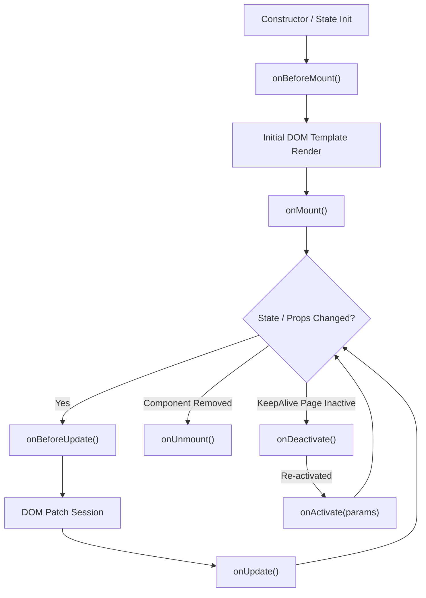

The base class from which all standard UI components inherit. It manages reactivity, templates, lifecycle methods, and slot rendering.

## Properties

- `this.state` (Proxy): The reactive state instance for local properties. Changing state triggers updates automatically.
- `this.props` (Proxy): The reactive attributes passed by parent tags. Modifications from parents trigger updates.
- `this.provide` / `provide()`: Defines state, properties, or methods to provide to descendant components.
- `static inject` / `this.inject`: Defines ancestor properties to inject and make available locally on `this`.


## Lifecycle Hooks

Implement these functions in your component logic to execute code at specific points in the component's lifespan:

## Component Lifecycle Hooks

Avenx-JS component instances transition through a well-defined lifecycle: creation, initial template compilation, DOM mounting, reactive updates, deactivation (for `keepAlive` pages), and unmounting.

You can implement lifecycle hooks either as `<action name="...">` tags inside Single-File Components (`.component.js` / `.page.js`) or as class methods when extending `AvenxComponent` / `AvenxPage`.

```html
<!-- Single-File Component (.component.js) Example -->
<state items="[]" isLoading="true" />

<action name="onBeforeMount">
  console.log('onBeforeMount: Template compiled, about to attach to DOM');
</action>

<action name="onMount">
  console.log('onMount: Attached to DOM. Fetching initial data...');
  this.loadItems();
</action>

<action name="loadItems">
  this.state.items = ['Item 1', 'Item 2'];
  this.state.isLoading = false;
</action>

<action name="onBeforeUpdate">
  console.log('onBeforeUpdate: Reactive state changed, about to patch DOM');
</action>

<action name="onUpdate">
  console.log('onUpdate: DOM patch complete');
</action>

<action name="onUnmount">
  console.log('onUnmount: Component detaching from DOM');
</action>

<div>
  <p data-ax-show="isLoading">Loading items...</p>
  <ul>
    <@for item="item" in="items">
      <li>{{ item }}</li>
    </@for>
  </ul>
</div>
```

```javascript
// Class-Based Component Example
export default class MyComponent extends AvenxComponent {
  onBeforeMount() {
    console.log('onBeforeMount');
  }

  onMount() {
    console.log('onMount');
  }

  onBeforeUpdate() {
    console.log('onBeforeUpdate');
  }

  onUpdate() {
    console.log('onUpdate');
  }

  onUnmount() {
    console.log('onUnmount');
  }

  onErrorCaptured(error, childInstance, info) {
    console.error('onErrorCaptured:', error, info);
    return false; // Prevent further error propagation
  }
}
```

### Complete Lifecycle Hooks Reference

| Hook Name | Parameters | Description |
| :--- | :--- | :--- |
| `onBeforeMount()` | None | Called after state and actions are set up, right before the component template is compiled and inserted into the DOM. |
| `onMount()` | None | Called immediately after the component element is attached to the DOM. Ideal for initial API data fetches, setting up timers, or DOM queries. |
| `onBeforeUpdate()` | None | Called right before the DOM is patched following a reactive state or props change. Useful for reading current DOM scroll positions or focus states. |
| `onUpdate()` | None | Called immediately after the DOM patch update finishes. Ideal for DOM measurements or re-initializing third-party UI widgets. |
| `onActivate(params)` | `params: Object` | Called whenever a cached page configured with `keepAlive: true` becomes active. Receives current route parameters. |
| `onDeactivate()` | None | Called when navigating away from a page configured with `keepAlive: true`. The page remains cached in memory rather than unmounted. |
| `onUnmount()` | None | Called right before the component element is unmounted and detached from the DOM. Use this to clean up timers, global event listeners, and subscriptions. |
| `onErrorCaptured(err, instance, info)` | `err: Error, instance: Object, info: String` | Called when an unhandled exception is caught from a descendant child component. Return `false` to stop error propagation. |

---

### Execution Order Lifecycle Flowchart



### Parent-Child Lifecycle Execution Order

When a parent component renders child components:

1. **Mount Phase**:
   - `Parent.onBeforeMount()`
   - `Child.onBeforeMount()`
   - `Child.onMount()` (Child mounts first)
   - `Parent.onMount()` (Parent mounts after all children finish mounting)

2. **Update Phase**:
   - `Parent.onBeforeUpdate()`
   - `Child.onBeforeUpdate()`
   - `Child.onUpdate()`
   - `Parent.onUpdate()`

3. **Unmount Phase**:
   - `Parent.onUnmount()`
   - `Child.onUnmount()`

---

### Example: Refreshing Data on Activation

Pages configured with `keepAlive: true` remain cached when users navigate away. Use `onActivate(params)` to refresh route-dependent data whenever the cached page becomes active again.

```javascript
class ProfilePage extends AvenxPage {
  async onActivate(params) {
    await this.loadProfile(params.id);
  }

  async loadProfile(id) {
    // Fetch the latest profile data
  }
}
```

Unlike `onMount()`, which runs only once when the component is first created, `onActivate(params)` runs every time a cached page is restored, making it the preferred place to reload data that depends on the current route.

### Error Boundaries with `onErrorCaptured`

The `onErrorCaptured(error, instance, info)` hook captures unhandled exceptions thrown by descendant child components during lifecycle execution or action evaluation.

- Return `false` from `onErrorCaptured` to stop error propagation up the component tree and prevent triggering global error handlers.
- Update reactive state inside `onErrorCaptured` to render fallback UI components cleanly.

```javascript
class ErrorBoundary extends AvenxComponent {
  onErrorCaptured(error, childInstance, info) {
    console.error(`Captured error from ${childInstance.constructor.name} during ${info}:`, error);
    this.state.hasError = true;
    this.state.errorMessage = error.message;
    return false; // Stop propagation
  }
}
```


## DOM Events

In addition to the lifecycle hooks above, which you implement _inside_ your component class, `AvenxComponent` also dispatches native DOM [`CustomEvent`](https://developer.mozilla.org/en-US/docs/Web/API/CustomEvent)s directly on the component's root element at the same points in its lifecycle. This makes it possible to hook into a component's lifecycle from _outside_ the component — for example, when integrating a third-party library, or when a parent script doesn't have direct access to the component instance.

| Event Name      | Dispatched                                                        |
| --------------- | ----------------------------------------------------------------- |
| `avenx:mount`   | After the component has mounted and `onMount()` has run.          |
| `avenx:update`  | After the component has updated and `onUpdate()` has run.         |
| `avenx:unmount` | Before the component is detached, just before `onUnmount()` runs. |

Because these are standard DOM events, you can attach listeners to them the same way you would any other native event, using `addEventListener`:

```javascript
const btn = new ButtonComponent();
btn.mount('#button-container');

// Listen for updates from outside the component
btn.el.addEventListener('avenx:update', () => {
  console.log('ButtonComponent updated — re-initializing third-party widget');
  someThirdPartyLibrary.refresh(btn.el);
});

btn.el.addEventListener('avenx:unmount', () => {
  console.log('ButtonComponent is about to unmount — cleaning up widget');
  someThirdPartyLibrary.destroy(btn.el);
});
```

This pattern is especially useful for integrating libraries that need to re-initialize themselves whenever the DOM changes (e.g. tooltip libraries, chart libraries, or jQuery plugins) without needing to modify the component's own source code.

## Core Methods

### `mount(target)`

Mounts the component to the target DOM element or selector.

```javascript
const btn = new ButtonComponent();
btn.mount('#button-container');
```

### `setProps(newProps)`

Updates the component's reactive `props` to match `newProps`. New or changed properties are applied, and properties omitted from `newProps` are removed. These reactive changes trigger the update scheduler, which queues a DOM patch with the component's updated props.

| Param      | Type     | Description                         |
| ---------- | -------- | ----------------------------------- |
| `newProps` | `object` | The complete set of props to apply. |

```javascript
const btn = new ButtonComponent();
btn.mount('#button-container');

btn.setProps({
  label: 'Saving...',
  disabled: true,
});
```

### `unmount()`

Cleans up event listeners and empties the mounted container.

### `$watch(source, callback, options)`

Watches a reactive state property or computed getter for changes. Supports dot-separated string paths (e.g., `'user.settings.theme'`) or inline getter functions (`() => this.state.user.settings.theme`).

The method is also exposed inside template expressions and component methods.

| Param | Type | Description |
| :--- | :--- | :--- |
| `source` | `string \| Function` | Dot-separated string path (e.g. `'user.settings.theme'`) or getter function returning the watched value. |
| `callback` | `Function` | Invoked when the watched value changes. Receives `(newValue, oldValue)` as arguments. |
| `options` | `object` | Optional. Configuration options: `immediate`, `deep`, `flush`. |

#### Watcher Options (`options`)

| Option | Type | Default | Description |
| :--- | :--- | :--- | :--- |
| `immediate` | `boolean` | `false` | When `true`, executes the callback immediately upon watcher registration with the current value (`oldValue` is `undefined`). |
| `deep` | `boolean` | `false` | When `true`, recursively tracks deep object and array mutations within nested structures. |
| `flush` | `string` | `'pre'` | Controls callback execution timing relative to DOM updates: `'pre'` (before DOM patch), `'post'` (after DOM patch), or `'sync'` (synchronously). |

#### Usage Examples

```javascript
const comp = new SettingsComponent();

// 1. Basic watcher
comp.$watch('user.settings.theme', (newVal, oldVal) => {
  console.log(`Theme changed from ${oldVal} to ${newVal}`);
});

// 2. Immediate watcher for initial setup
comp.$watch('filterQuery', (query) => {
  this.fetchResults(query);
}, { immediate: true });

// 3. Deep watcher for nested state objects
comp.$watch('user.profile', (newProfile) => {
  console.log('Nested user profile updated:', newProfile);
}, { deep: true });

// 4. Post-flush watcher to access updated DOM nodes
comp.$watch('items.length', () => {
  const container = this.el.querySelector('.list-container');
  container.scrollTop = container.scrollHeight;
}, { flush: 'post' });
```


### `update()`

Forces a DOM patch and re-evaluates slots. Typically called automatically by the scheduler.
