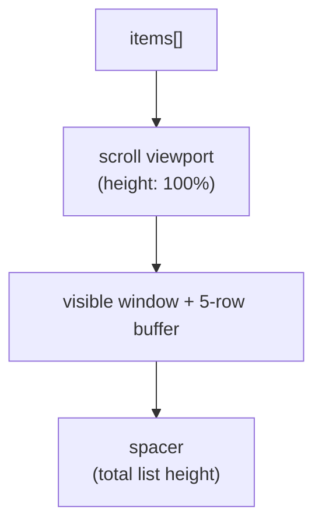

The `<VirtualList>` component is a built-in, globally available component for rendering large datasets without creating a DOM node per item. It keeps one scroll viewport, renders only the rows near the visible window, recycles those elements as the user scrolls, and measures dynamic row heights with a `ResizeObserver`.



The spacer is not a second list. It gives the scrollbar the full dataset height while the viewport only patches the small number of recycled rows needed for the current window.

## Props

| Prop | Type | Default | Description |
| :--- | :--- | :--- | :--- |
| `items` | `Array` | `[]` | The array of dataset items to render in the virtual list. |
| `itemHeight` / `item-height` | `Number` | `40` | Default row height in pixels. Supports both camelCase (`itemHeight`) and kebab-case (`item-height`). |
| `pageSize` / `page-size` | `Number` | `0` | Number of items per page. When set (> 0), activates built-in paginated mode. |
| `page` / `current-page` | `Number` | `1` | The currently active 1-based page index. |
| `totalItems` / `total-items` | `Number` | `items.length` | Total dataset count. Useful for server-side pagination when `items` contains only the current page payload. |
| `showControls` / `show-controls` | `Boolean` | `true` | Whether to display the bottom pagination control bar when `pageSize > 0`. |

> [!IMPORTANT]
> `bufferSize` and `containerHeight` are not component props. The render buffer is fixed at five rows internally, and the viewport fills its parent with `height: 100%`. If the parent has no resolved height, the viewport falls back to a `clientHeight` of `400px`.

---

## Scroll container requirements

The component owns its scroll container. The generated viewport uses:

```css
overflow-y: auto;
position: relative;
height: 100%;
width: 100%;
```

Give the parent of `<VirtualList>` a definite height:

```css
.virtual-list-shell {
  height: 480px;
}
```

The component observes the viewport and each rendered row with a single `ResizeObserver`. Row height changes are applied on the next animation frame, so height changes do not force a synchronous full relayout.

Row markup should use `box-sizing: border-box` and avoid relying on vertical margin collapse. Padding inside the row is safer than margins between rows because the measured `offsetHeight` stays predictable.

## Template slot scope and `index`

To define row markup inside `<VirtualList>`, place a `<template data-ax-as="...">` slot tag inside the component element.

The slot scope exposes:

| Variable | Type | Description |
| :--- | :--- | :--- |
| `item` *(or custom alias)* | `Object \| any` | The dataset item for the current row. Rename it with `data-ax-as="alias"`. |
| `index` | `Number` | The zero-based index of the current item in `items`. |

## Usage examples

### Basic usage

```html
<state items="[
  { id: 1, name: 'Alice' },
  { id: 2, name: 'Bob' },
  { id: 3, name: 'Charlie' }
]" />

<VirtualList :item-height="50" :items="items">
  <template data-ax-as="user">
    <div class="user-row">
      <span class="user-index">#{{ index + 1 }}</span>
      <span class="user-name">{{ user.name }}</span>
    </div>
  </template>
</VirtualList>
```

### Custom item alias

Use `data-ax-as` to rename the item variable while keeping `index`:

```html
<VirtualList :item-height="60" :items="products">
  <template data-ax-as="product">
    <div class="product-item">
      <span class="badge">Row {{ index }}</span>
      <strong>{{ product.title }}</strong> — ${{ product.price }}
    </div>
  </template>
</VirtualList>
```

### Dynamic row heights

Set a conservative default with `item-height`, then let the `ResizeObserver` replace it with the measured height of each row:

```html
<VirtualList :item-height="48" :items="messages">
  <template data-ax-as="message">
    <div class="message-row">
      <strong>{{ message.author }}</strong>
      <p>{{ message.body }}</p>
    </div>
  </template>
</VirtualList>
```

```css
.message-row {
  box-sizing: border-box;
  padding: 8px 12px;
  border-bottom: 1px solid var(--border);
}
```

The default height is used only until the row is measured. A row that grows or shrinks is re-measured and the spacer offsets are updated.

### Infinite scrolling with a load-more action

`<VirtualList>` does not expose a scroll callback prop. Scroll handling is internal and throttled with `requestAnimationFrame`. For a load-more UX, append to `items` from an action; `onUpdate` recalculates the window automatically.

```html
<state items="[]" page="0" loading="false" hasMore="true" />

<action name="onMount">
  this.loadMore()
</action>

<action name="loadMore">
  if (this.state.loading || !this.state.hasMore) return
  this.state.loading = true
  fetch(`/api/items?page=${this.state.page}`)
    .then((response) => response.json())
    .then((next) => {
      this.state.items = [...this.state.items, ...next.items]
      this.state.page += 1
      this.state.hasMore = next.has_more
      this.state.loading = false
    })
</action>

<div class="virtual-list-shell">
  <VirtualList :item-height="48" :items="items">
    <template data-ax-as="item">
      <div class="row">{{ item.title }}</div>
    </template>
  </VirtualList>
  <button @click="loadMore()" data-ax-show="hasMore && !loading">Load more</button>
  <p data-ax-show="loading">Loading...</p>
</div>
```

### High-volume API Data Fetching with `<resource>` & `<@suspense>`

When fetching large datasets (e.g., 10,000+ items) from an API endpoint using `<resource>`, combine `<VirtualList>` with `<@suspense>` and `<@errorBoundary>`. The resource handles async data fetching and pending states, while `<VirtualList>` ensures only the visible rows are rendered into DOM nodes:

```html
<resource name="users">
  return fetch('/api/users').then((res) => {
    if (!res.ok) throw new Error(`API Error: ${res.statusText}`);
    return res.json();
  });
</resource>

<@errorBoundary>
  <@fallback as="err">
    <div class="error-banner">Failed to load user directory: {{ err.message }}</div>
  </@fallback>

  <@suspense>
    <@fallback>
      <div class="loading-spinner">Fetching large user dataset from API...</div>
    </@fallback>

    <!-- Once resolved, users array is passed to VirtualList for high-performance rendering -->
    <div class="virtual-list-shell" style="height: 500px;">
      <VirtualList :item-height="40" :items="users">
        <template data-ax-as="user">
          <div class="user-row">
            <span class="user-id">#{{ index + 1 }}</span>
            <span class="user-name">{{ user.username }}</span>
            <span class="user-email">{{ user.email }}</span>
          </div>
        </template>
      </VirtualList>
    </div>
  </@suspense>
</@errorBoundary>
```

## Performance tips

- Keep row templates light. The component patches recycled nodes, but a heavy template still costs work on every scroll frame.
- Prefer a stable `item-height` when rows are uniform. Dynamic heights are supported, but each measured change schedules a relayout.
- Update `items` with a new array when data changes so the component's update path runs.
- Do not add another `ResizeObserver` per row. The built-in observer already watches the viewport and every rendered row.
- Let the fixed five-row buffer handle overscroll. Setting a larger buffer is not supported because the component owns that value internally.

## Troubleshooting

- **The list does not scroll.** The parent has no resolved height. Give it an explicit height or a flex/grid container height.
- **Rows jump while scrolling.** Dynamic row heights are being re-measured. Keep content heights stable or make the default `item-height` closer to the real first-measurement height.
- **Nothing renders.** `items` is empty or no `<template>` slot was provided. The component requires a row template to create elements.
