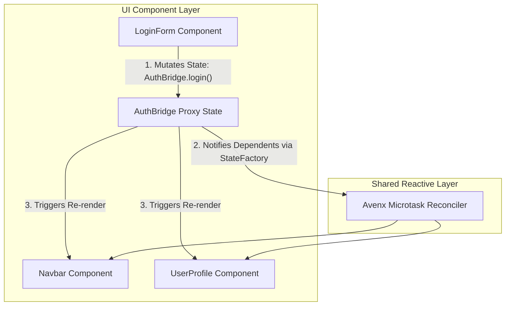
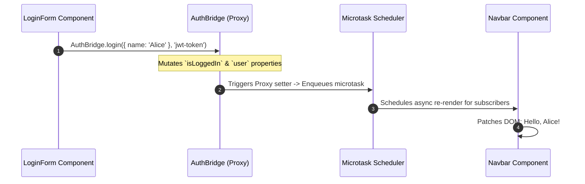

---

Bridges provide an elegant, lightweight solution for sharing state and business logic across multiple components or pages without prop-drilling.

## Creating a Bridge

Generate a new bridge using the CLI tool:

```bash
npx avenx g bridge auth
```

This creates a file in `src/global/auth.bridge.js`. The generated bridge uses the class-based pattern and extends the `AvenxBridge` base class:

```javascript
// src/global/auth.bridge.js
import { AvenxBridge } from 'avenx-core/runtime';

export default class AuthBridge extends AvenxBridge {
  constructor() {
    super();

    this.isLoggedIn = false;
    this.user = {
      name: 'Guest',
      role: 'visitor',
    };
  }

  logout() {
    this.isLoggedIn = false;
    this.user.name = 'Guest';
  }
}
```

## The `AvenxBridge` Base Class

The `AvenxBridge` base class provides the foundation for creating class-based bridges in Avenx-JS. Extending this class keeps bridge definitions consistent with Avenx's object-oriented model and the bridge structure generated by the CLI.

The bridge constructor is responsible for initializing the shared state. Calling `super()` initializes the `AvenxBridge` base class before defining state properties on the bridge instance.

```javascript
constructor() {
  super();

  this.isLoggedIn = false;
  this.user = {
    name: 'Guest',
    role: 'visitor',
  };
}
```

Methods containing shared business logic can be defined directly on the bridge class. These methods can read and modify the bridge's shared state using `this`.

## Step-by-Step Tutorial: Global Authentication State

Follow this step-by-step guide to implement a shared authentication store used across multiple components in your application.

### Step 1: Create the Bridge File

Create a file named `src/global/auth.bridge.js` (or use `npx avenx g bridge auth`):

```javascript
// src/global/auth.bridge.js
import { AvenxBridge } from 'avenx-core/runtime';

export default class AuthBridge extends AvenxBridge {
  constructor() {
    super();

    // Defined reactive state fields
    this.isLoggedIn = false;
    this.token = null;
    this.user = {
      name: 'Guest',
      role: 'visitor',
    };
  }

  // Action methods mutating shared state
  login(userData, token) {
    this.isLoggedIn = true;
    this.token = token;
    this.user = { ...userData };
  }

  logout() {
    this.isLoggedIn = false;
    this.token = null;
    this.user = {
      name: 'Guest',
      role: 'visitor',
    };
  }
}
```

### Step 2: Mutate Bridge State in a Component (`LoginForm.component.js`)

In your login form component, reference `AuthBridge` directly inside `<action>` methods or template event handlers to mutate global state:

```html
<!-- src/components/login-form.component.js -->
<state username="" password="" errorMessage="" />

<action name="handleSubmit">
  if (!state.username || !state.password) {
    state.errorMessage = 'Please provide username and password.';
    return;
  }

  // Perform login action and update global AuthBridge state
  AuthBridge.login({ name: state.username, role: 'member' }, 'sample-jwt-token');
  state.errorMessage = '';
</action>

<div class="login-box">
  <h2>Login</h2>
  <p class="error" data-ax-show="state.errorMessage">{{ state.errorMessage }}</p>

  <input type="text" data-ax-bind="state.username" placeholder="Username" />
  <input type="password" data-ax-bind="state.password" placeholder="Password" />

  <button @click="handleSubmit()">Log In</button>
</div>
```

### Step 3: Consume Shared State in Another Component (`Navbar.component.js`)

In your navigation header or user profile component, read `AuthBridge` state properties. Any change to `AuthBridge` automatically triggers a re-render in `Navbar`:

```html
<!-- src/components/navbar.component.js -->
<nav class="navbar">
  <div class="brand">Avenx App</div>

  <div class="user-section">
    <!-- Rendered when user is logged out -->
    <div data-ax-show="!AuthBridge.isLoggedIn">
      <span>Welcome, Guest</span>
    </div>

    <!-- Rendered when user is logged in -->
    <div data-ax-show="AuthBridge.isLoggedIn">
      <span>Hello, <strong>{{ AuthBridge.user.name }}</strong> ({{ AuthBridge.user.role }})</span>
      <button @click="AuthBridge.logout()">Log Out</button>
    </div>
  </div>
</nav>
```

## Plain Object Bridges

Class-based bridges extending `AvenxBridge` are the primary approach and match the structure generated by the Avenx CLI. However, bridges can also be defined using plain JavaScript objects:

```javascript
// src/global/auth.bridge.js
export default {
  isLoggedIn: false,
  user: {
    name: 'Guest',
    role: 'visitor',
  },
  logout() {
    this.isLoggedIn = false;
    this.user.name = 'Guest';
  },
};
```

Plain object bridges provide a simpler alternative for small amounts of shared state and business logic. For consistency with the CLI-generated structure and Avenx's object-oriented model, the class-based `AvenxBridge` pattern is recommended as the primary approach.

## Compilation Lifecycle & Limits

The Avenx compiler processes `.bridge.js` files by extracting the bridge definition beginning at `export default`. Declarations placed before `export default`, such as local variables, constants, and helper functions, are not preserved in the compiled output.

As a result, bridge code that depends on declarations defined above `export default` may cause runtime `ReferenceError` exceptions after compilation.

For example, avoid defining local utilities before the bridge export:

```javascript
const defaultRole = 'visitor';

function createGuestUser() {
  return {
    name: 'Guest',
    role: defaultRole,
  };
}

export default class AuthBridge extends AvenxBridge {
  constructor() {
    super();
    this.user = createGuestUser();
  }
}
```

In this example, `defaultRole` and `createGuestUser` are declared before `export default` and may be removed during compilation, leaving the bridge with references to declarations that no longer exist.

Instead, keep helper methods inside the exported bridge class when the logic belongs specifically to that bridge:

```javascript
export default class AuthBridge extends AvenxBridge {
  constructor() {
    super();
    this.user = this.createGuestUser();
  }

  createGuestUser() {
    return {
      name: 'Guest',
      role: 'visitor',
    };
  }
}
```

For reusable utilities shared across multiple parts of an application, move the logic into external utility files and expose it through supported application patterns. Utilities that are intentionally available globally can also be referenced through properties on the `window` object.

```javascript
export default class AuthBridge extends AvenxBridge {
  constructor() {
    super();
    this.user = window.AppUtils.createGuestUser();
  }
}
```

When writing `.bridge.js` files:

- Do not rely on variables, constants, or helper functions declared before `export default`.
- Keep bridge-specific helper methods inside the exported bridge class.
- Move reusable logic into external utility files.
- Reference intentionally global utilities through properties on `window`.

Understanding these compilation limits helps prevent missing declarations and runtime `ReferenceError` exceptions caused by helper code being removed from the compiled output.

## End-to-End Global Store Patterns

The examples below show complete create → register → bind flows for common shared-state use cases. Each bridge is a single reactive source of truth; components that read its properties re-render when those properties change.

### Theme Switching Store

```javascript
// src/global/theme.bridge.js
import { AvenxBridge } from 'avenx-core/runtime';

export default class ThemeBridge extends AvenxBridge {
  constructor() {
    super();
    this.mode = 'light'; // 'light' | 'dark'
  }

  toggle() {
    this.mode = this.mode === 'light' ? 'dark' : 'light';
  }

  setMode(mode) {
    this.mode = mode === 'dark' ? 'dark' : 'light';
  }
}
```

```html
<!-- Any component template -->
<div class="shell" data-theme="{{ ThemeBridge.mode }}">
  <button @click="ThemeBridge.toggle()">
    Switch to {{ ThemeBridge.mode === 'light' ? 'dark' : 'light' }} mode
  </button>
</div>
```

Updating `ThemeBridge.mode` (via `toggle()`, `setMode()`, or direct assignment) notifies every component that interpolated `ThemeBridge.mode`, so headers, pages, and widgets stay in sync without prop drilling.

### Authentication Store

```javascript
// src/global/auth.bridge.js
import { AvenxBridge } from 'avenx-core/runtime';

export default class AuthBridge extends AvenxBridge {
  constructor() {
    super();
    this.isLoggedIn = false;
    this.token = null;
    this.user = { name: 'Guest', role: 'visitor' };
  }

  login(user, token) {
    this.isLoggedIn = true;
    this.token = token;
    this.user = user;
  }

  logout() {
    this.isLoggedIn = false;
    this.token = null;
    this.user = { name: 'Guest', role: 'visitor' };
  }
}
```

```html
<!-- Navbar -->
<span data-ax-show="AuthBridge.isLoggedIn">Hello, {{ AuthBridge.user.name }}</span>
<button data-ax-show="AuthBridge.isLoggedIn" @click="AuthBridge.logout()">Log out</button>

<!-- Protected page action -->
<action name="save">
  if (!AuthBridge.isLoggedIn) {
    return;
  }
  // proceed with authenticated request using AuthBridge.token
</action>
```

### Shopping Cart Store

```javascript
// src/global/cart.bridge.js
import { AvenxBridge } from 'avenx-core/runtime';

export default class CartBridge extends AvenxBridge {
  constructor() {
    super();
    this.items = [];
  }

  get itemCount() {
    return this.items.reduce((sum, item) => sum + item.qty, 0);
  }

  get subtotal() {
    return this.items.reduce((sum, item) => sum + item.price * item.qty, 0);
  }

  addItem(product) {
    const existing = this.items.find((item) => item.id === product.id);
    if (existing) {
      existing.qty += 1;
      // Reassign the array so dependents observing `items` re-render reliably
      this.items = [...this.items];
      return;
    }
    this.items = [...this.items, { ...product, qty: 1 }];
  }

  clear() {
    this.items = [];
  }
}
```

```html
<!-- Header badge -->
<span class="cart-badge">{{ CartBridge.itemCount }}</span>

<!-- Cart page -->
<ul>
  <li data-ax-for="item in CartBridge.items">
    {{ item.name }} × {{ item.qty }}
  </li>
</ul>
<p>Subtotal: {{ CartBridge.subtotal }}</p>
```

## Cross-Component Synchronization & Reactivity Flow

Avenx-JS uses transparent Proxy-based tracking for bridge state. When a component reads a property on a bridge (in its template or computed getter), Avenx-JS automatically registers that component as a subscriber to that exact state path.

### Architectural Diagram



### Execution Sequence



### Flow Breakdown

1. **Auto Discovery & Registration**: The compiler discovers `*.bridge.js` files and registers each bridge on the application (typically capitalized with `Bridge` suffix, e.g. `AuthBridge`).
2. **Dependency Tracking**: During template rendering, reading `AuthBridge.user.name` registers the component as an active listener for changes to `AuthBridge.user`.
3. **Reactive State Mutation**: When another component (e.g. `LoginForm`) calls `AuthBridge.login()`, the Proxy setter catches the mutation.
4. **Targeted Asynchronous Flush**: The Avenx microtask scheduler queues a single update. Only components observing the mutated properties re-render; unrelated components are skipped.

Manual registration for custom testing or manual setup:

```javascript
import { AvenxApp } from 'avenx-core/runtime';
import AuthBridge from './global/auth.bridge.js';

const app = new AvenxApp({ target: '#app' });
app.registerBridge('AuthBridge', new AuthBridge());
```

## Lifecycle, Subscriptions & Teardown

Bridges registered on the application instance remain active for the full lifetime of the app. However, if a bridge opens external subscriptions (such as WebSockets, `setInterval` timers, or `window` / `document` event listeners), you must manage cleanup to prevent memory leaks and dangling handlers.

### Handling Subscriptions and Cleanup

Implement a dedicated `destroy()` or `teardown()` method in your bridge to remove active listeners and reset state:

```javascript
// src/global/notification.bridge.js
import { AvenxBridge } from 'avenx-core/runtime';

export default class NotificationBridge extends AvenxBridge {
  constructor() {
    super();
    this.messages = [];
    this.unreadCount = 0;

    // Attach external storage listener for cross-tab sync
    this.handleStorageChange = this.handleStorageChange.bind(this);
    window.addEventListener('storage', this.handleStorageChange);

    // Setup periodic polling interval
    this.pollTimer = setInterval(() => this.fetchUnreadCount(), 30000);
  }

  handleStorageChange(event) {
    if (event.key === 'app_notifications') {
      this.messages = JSON.parse(event.newValue || '[]');
      this.unreadCount = this.messages.length;
    }
  }

  async fetchUnreadCount() {
    // Polling logic...
  }

  /**
   * Cleans up timers, external event listeners, and resets state.
   */
  destroy() {
    if (this.pollTimer) {
      clearInterval(this.pollTimer);
      this.pollTimer = null;
    }
    window.removeEventListener('storage', this.handleStorageChange);
    this.messages = [];
    this.unreadCount = 0;
  }
}
```

### Best Practices for Long-Lived Applications

- **Reset State on Logout**: Always clear tokens, user profiles, and sensitive state when a session ends (`AuthBridge.logout()`).
- **Clean Up Timers and Event Listeners**: Always store timer IDs and bound handler references so they can be removed in `destroy()`.
- **Drop Unmounted References**: In test harnesses or sandboxed sub-apps, unregister or drop bridge references so instances can be garbage collected.

## Best Practices

### Initialize state in the constructor

Set every shared field to a defined default in `constructor()` after `super()`. Avoid lazy `undefined` fields that first appear mid-session — they make template guards harder and can skip early dependency tracking.

### Prefer narrow mutations over wholesale replacement

Mutate the specific property that changed (`AuthBridge.user.name = 'Ada'`) when possible. Replacing large nested objects forces more dependents to re-evaluate. When you must replace arrays (for example after `push`-style edits that proxies may not always surface cleanly), assign a new array reference intentionally: `this.items = [...this.items, next]`.

### Avoid full-app re-render bottlenecks

- Keep hot paths (animation frames, pointer moves) out of bridge state; use local component state instead.
- Do not store derived UI flags that every layout shell reads if only one widget needs them.
- Split large domains into multiple bridges (`AuthBridge`, `CartBridge`, `ThemeBridge`) rather than one mega-store.
- In tests, use `AvenxMock.createMockBridge()` and `sandbox.waitForUpdate()` so you assert after a single batched flush.

## TypeScript Guidelines

```typescript
import { AvenxBridge } from 'avenx-core/runtime';

export interface AuthUser {
  name: string;
  role: 'visitor' | 'member' | 'admin';
}

export default class AuthBridge extends AvenxBridge {
  isLoggedIn: boolean;
  token: string | null;
  user: AuthUser;

  constructor() {
    super();
    this.isLoggedIn = false;
    this.token = null;
    this.user = { name: 'Guest', role: 'visitor' };
  }

  login(user: AuthUser, token: string): void {
    this.isLoggedIn = true;
    this.token = token;
    this.user = user;
  }

  logout(): void {
    this.isLoggedIn = false;
    this.token = null;
    this.user = { name: 'Guest', role: 'visitor' };
  }
}
```

Declare field types on the class body, initialize them in the constructor, and type method parameters/returns. Templates still access the bridge as `AuthBridge`; TypeScript mainly improves bridge modules, IDE completion, and unit tests that import the class directly.
