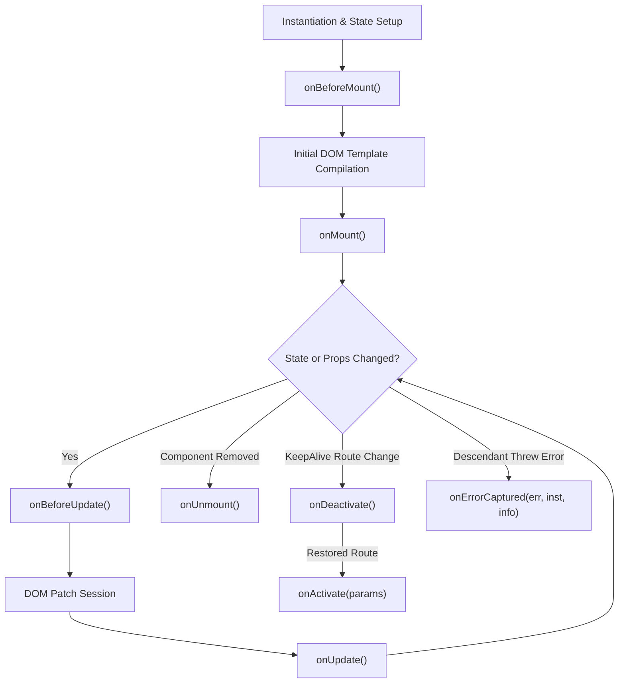

Avenx-JS components go through a structured series of initialization, mounting, updating, and unmounting phases during their lifecycle. Lifecycle hooks allow you to execute custom logic at specific stages of a component's lifetime — such as fetching API data when a component mounts, adjusting DOM scroll positions after updates, capturing descendant errors, or cleaning up timers when unmounting.

---

## Lifecycle Overview & Execution Flow



### Lifecycle Hooks Summary Matrix

| Hook Name | Execution Phase | DOM Available? | Primary Purpose |
| --- | --- | --- | --- |
| `onBeforeMount()` | Pre-Mount | ❌ No | Initialize non-reactive variables, prepare state values. |
| `onMount()` | Mounting | ✅ Yes | Fetch initial API data, measure DOM dimensions, attach listeners, start timers. |
| `onBeforeUpdate()` | Pre-Patch | ✅ Yes | Read DOM scroll/cursor positions before patching updates. |
| `onUpdate()` | Post-Patch | ✅ Yes | Adjust DOM scroll, re-initialize third-party DOM widgets. |
| `onUnmount()` | Teardown | ✅ Yes (pre-removal) | Clear timers (`clearInterval`), remove `window` listeners, close WebSockets. |
| `onActivate(params)` | KeepAlive Active | ✅ Yes | Triggered when returning to a cached `keepAlive` page route. |
| `onDeactivate()` | KeepAlive Inactive | ✅ Yes | Triggered when navigating away from a cached `keepAlive` page route. |
| `onErrorCaptured()` | Error Handling | ✅ Yes | Catches unhandled errors thrown by descendant components. |

---

## Detailed Lifecycle Hooks Reference

### 1. `onBeforeMount()`

- **Trigger:** Runs right after reactive state and methods are initialized, immediately before the component's HTML template is compiled and inserted into the DOM.
- **Use Cases:** Initializing non-reactive local variables, computing pre-render data, or setting up early event listeners.
- **DOM Availability:** The component's DOM element (`this.el`) is **not** yet attached to the document.

```javascript
onBeforeMount() {
  console.log('Component is about to mount. Reactive state is ready.');
  this._startTime = Date.now();
}
```

---

### 2. `onMount()`

- **Trigger:** Runs immediately after the component element is mounted to the document DOM.
- **Use Cases:** Fetching initial API data, querying DOM element dimensions, attaching global event listeners, or starting timers.
- **DOM Availability:** Fully mounted and accessible via `this.el`.

```html
<!-- src/components/user-profile.component.js -->
<state user="null" isLoading="true" errorMessage="" />

<action name="onMount">
  this.fetchUserData();
</action>

<action name="fetchUserData">
  try {
    const response = await fetch('/api/user');
    if (!response.ok) throw new Error('Failed to load user profile');
    this.state.user = await response.json();
  } catch (err) {
    this.state.errorMessage = err.message;
  } finally {
    this.state.isLoading = false;
  }
</action>

<div class="user-profile">
  <div data-ax-show="state.isLoading">Loading profile...</div>
  <div data-ax-show="state.errorMessage" class="error">{{ state.errorMessage }}</div>

  <div data-ax-show="state.user">
    <h2>{{ state.user?.name }}</h2>
    <p>Email: {{ state.user?.email }}</p>
  </div>
</div>
```

---

### 3. `onBeforeUpdate()`

- **Trigger:** Runs right before Avenx-JS patches the DOM following a reactive `state` or `props` change.
- **Use Cases:** Reading current DOM scroll positions, input cursor positions, or element dimensions before new state changes alter the DOM structure.

```javascript
onBeforeUpdate() {
  const container = this.el.querySelector('.chat-history');
  if (container) {
    this._wasScrolledToBottom = container.scrollHeight - container.scrollTop === container.clientHeight;
  }
}
```

---

### 4. `onUpdate()`

- **Trigger:** Runs immediately after DOM diffing and patching complete.
- **Use Cases:** Re-initializing third-party JavaScript libraries (e.g. chart widgets, tooltips), adjusting scroll positions, or performing post-patch DOM measurements.

```javascript
onUpdate() {
  if (this._wasScrolledToBottom) {
    const container = this.el.querySelector('.chat-history');
    if (container) {
      container.scrollTop = container.scrollHeight;
    }
  }
}
```

> [!CAUTION]
> **Preventing Infinite Loops (`AVX_R11`):** Do not mutate reactive state synchronously inside `onBeforeUpdate()` or `onUpdate()`. Mutating state inside these hooks triggers another update cycle, causing an infinite loop.

---

### 5. `onUnmount()`

- **Trigger:** Runs right before the component instance is unmounted and detached from the DOM.
- **Use Cases:** Cleaning up `setInterval`/`setTimeout` timers, removing global `window` event listeners, or unsubscribing from WebSocket channels.

```html
<state count="0" />

<action name="onMount">
  // Store timer handle and window event listener
  this._timerId = setInterval(() => {
    this.state.count++;
  }, 1000);

  this.handleResize = () => console.log('Window resized:', window.innerWidth);
  window.addEventListener('resize', this.handleResize);
</action>

<action name="onUnmount">
  // Clean up all resources to prevent memory leaks
  if (this._timerId) {
    clearInterval(this._timerId);
    this._timerId = null;
  }
  if (this.handleResize) {
    window.removeEventListener('resize', this.handleResize);
  }
</action>

<div>Timer Count: {{ count }}</div>
```

---

### 6. `onActivate(params)` & `onDeactivate()`

- **Trigger:** Used exclusively for pages configured with `keepAlive: true` in the router.
- `onDeactivate()`: Runs when navigating away from a cached page instead of `onUnmount()`. The page instance remains in the LRU cache.
- `onActivate(params)`: Runs when returning to a cached page, receiving the latest route parameters.

```javascript
async onActivate(params) {
  console.log(`Restored cached page for user ID: ${params.id}`);
  await this.refreshUserFeed(params.id);
}

onDeactivate() {
  console.log('Page deactivated and saved to keepAlive cache.');
}
```

---

### 7. `onErrorCaptured(error, instance, info)`

- **Trigger:** Called when an unhandled exception is caught from a descendant child component.
- **Return Value:** Return `false` to stop error propagation up the component tree and prevent application crashes.

```javascript
onErrorCaptured(error, instance, info) {
  console.error(`Captured error from ${instance.constructor.name} during ${info}:`, error);
  this.state.hasError = true;
  this.state.errorMessage = error.message;
  return false; // Suppress further error propagation up the tree
}
```

---

## Async Lifecycle Hooks & Microtask Scheduling

Avenx-JS supports `async` functions within lifecycle hooks. When an async lifecycle hook executes, state mutations made before an `await` statement trigger batched DOM updates via the microtask queue.

### Handling Async Data & Unmounted State

When making asynchronous requests in `onMount()`, the HTTP request may resolve after the user has navigated away and the component has unmounted. Updating state on an unmounted component can waste memory or lead to errors.

Use an `AbortController` to cancel pending requests on unmount:

```javascript
// src/components/async-widget.component.js
export default {
  actions: {
    async onMount() {
      this._abortController = new AbortController();
      try {
        const res = await fetch('/api/data', { signal: this._abortController.signal });
        this.state.data = await res.json();
      } catch (err) {
        if (err.name !== 'AbortError') {
          this.state.error = err.message;
        }
      }
    },

    onUnmount() {
      if (this._abortController) {
        this._abortController.abort();
      }
    },
  },
};
```

---

## Defining Lifecycle Hooks in Component Files

In Avenx Single-File Components (`.component.js`), lifecycle hooks are declared using `<action>` tags with matching hook names:

```html
<state count="0" />

<action name="onMount">
  console.log('Component mounted successfully!');
</action>

<action name="onUnmount">
  console.log('Component cleanup completed.');
</action>

<div class="counter">
  <p>Count: {{ count }}</p>
</div>
```
