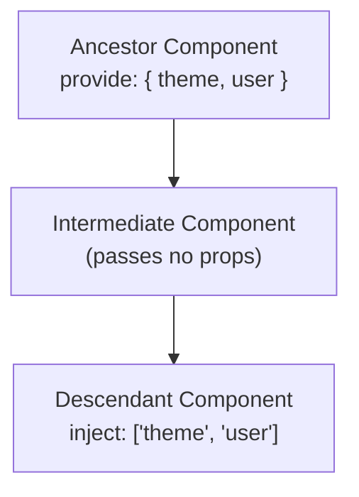

Avenx-JS provides a native **Provide & Inject** mechanism for ancestor-descendant component communication. It allows a parent or ancestor component to serve as a dependency provider for all its descendant components, regardless of how deeply nested they are, without having to pass props through intermediate components ("prop drilling").

## How Provide & Inject Works

1. **Ancestor Component**: Defines `provide` (as an object, an array, or a function returning an object) to specify state, properties, or methods made available to descendants.
2. **Descendant Component**: Defines `inject` (as an array of keys or an object mapping local property names to ancestor keys) to consume provided dependencies.
3. **Targeted Reactivity**: When an injected property or reactive state changes, Avenx-JS automatically updates only the subscribing descendant components without forcing intermediate components or parent templates to re-render.



---

## Providing Dependencies (`provide`)

You can define `provide` on a component or page instance in three ways:

### 1. Object-Based `provide`

Define `provide` as an object property on your component instance:

```javascript
// Provider Component / Page
this.provide = {
  theme: 'dark',
  changeTheme: (newTheme) => {
    this.state.theme = newTheme;
  },
};
```

### 2. Function-Based `provide()`

Define `provide()` as an instance method when you need to access reactive component state dynamically:

```javascript
// Provider Page / Component
export default class UserProfilePage extends AvenxPage {
  provide() {
    return {
      theme: this.state.currentTheme,
      role: this.state.userRole,
    };
  }
}
```

### 3. Array-Based `provide`

Provide state properties directly by name from your component's reactive `state`:

```javascript
// Provider Component
this.provide = ['color', 'mode'];
```

---

## Injecting Dependencies (`inject`)

Descendant components declare dependencies using `inject`, which can be specified as a static property on the component class or an instance property:

### 1. Array-Based `inject`

Inject properties using the exact key names defined by ancestor components:

```javascript
import { AvenxComponent } from 'avenx-core/runtime';

export default class ThemeBadge extends AvenxComponent {
  static inject = ['theme'];

  constructor(bridges, props) {
    super(
      {},
      {},
      bridges,
      '<span class="badge {{ theme }}">Current Theme: {{ theme }}</span>',
      {},
      props
    );
  }
}
```

Inside the child component template, `{{ theme }}` and `this.theme` are accessible directly and resolve to the value provided by the nearest ancestor.

### 2. Object-Based `inject` (Aliasing / Property Mapping)

Inject ancestor properties under custom local names:

```javascript
import { AvenxComponent } from 'avenx-core/runtime';

export default class UserCard extends AvenxComponent {
  // Maps local 'activeRole' property to ancestor provided key 'role'
  static inject = {
    activeRole: 'role',
    activeTheme: 'theme',
  };

  constructor(bridges, props) {
    super(
      {},
      {},
      bridges,
      '<div>User Role: {{ activeRole }} (Theme: {{ activeTheme }})</div>',
      {},
      props
    );
  }
}
```

---

## Reactivity & Scope Shadowing

### Targeted Reactivity Updates

When an ancestor component updates a provided property or reactive state:
- All child components injecting that property receive targeted reactivity updates and re-render.
- Intermediate components that do not inject the property are **not** re-rendered, optimizing runtime rendering performance.

### Ancestor Scope Shadowing

If multiple ancestors in a nested hierarchy provide the same key, a descendant component resolves the value from the **nearest ancestor** in its parent chain:

```text
Grandparent provides { theme: 'dark', apiVersion: 'v1' }
  ↓
Intermediate parent provides { theme: 'light' }
  ↓
Child injects ['theme', 'apiVersion']
Result: Child receives theme = 'light' (shadowed) and apiVersion = 'v1' (inherited from grandparent)
```

---

## Real-World Example: Theme & State Provider

Below is an end-to-end example demonstrating how an application layout component provides theme state and toggle actions to a deeply nested child button.

### Ancestor Provider (`AppLayout.page.js`)

```html
<state theme="dark" username="Alice" />

<div>
  <header>
    <h2>Welcome, {{ username }}</h2>
  </header>
  <main class="app-content">
    <ChildWidget />
  </main>
</div>
```

In the compiled component class or constructor initialization:

```javascript
this.provide = {
  theme: this.state.theme,
  toggleTheme: () => {
    this.state.theme = this.state.theme === 'dark' ? 'light' : 'dark';
  },
};
```

### Deeply Nested Consumer (`ThemeToggleButton.component.js`)

```javascript
import { AvenxComponent } from 'avenx-core/runtime';

export default class ThemeToggleButton extends AvenxComponent {
  static inject = ['theme', 'toggleTheme'];

  constructor(bridges, props) {
    super(
      {},
      {
        handleClick() {
          this.toggleTheme();
        },
      },
      bridges,
      '<button @click="handleClick()">Switch theme (Current: {{ theme }})</button>',
      {},
      props
    );
  }
}
```
