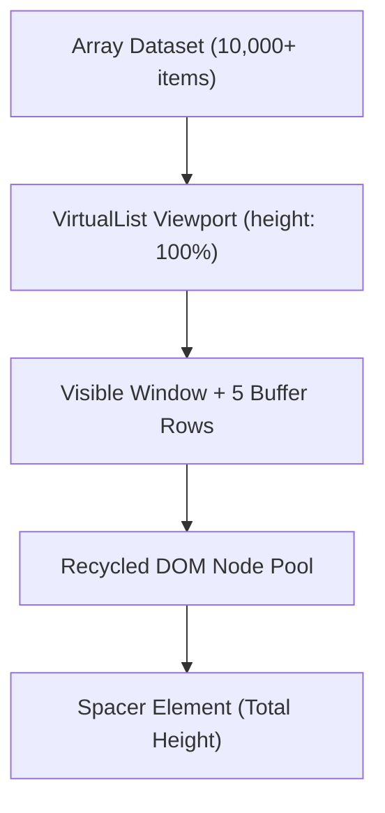

The `<VirtualList>` component is a built-in, globally available component designed for rendering massive datasets (thousands to millions of items) with minimal memory footprint and 60 FPS scrolling performance.



---

## Key Features & Architecture

- **DOM Node Recycling**: Creates and reuses only the small number of DOM elements needed to fill the visible window plus a small buffer.
- **Dynamic Height Measurement**: Integrated `ResizeObserver` automatically measures individual item heights and recalculates layout on the next animation frame.
- **Scroll Synchronization**: Throttled with `requestAnimationFrame` to prevent layout thrashing and maintain smooth scrolling.
- **Built-in Pagination**: Supports client-side and server-side paginated rendering mode with navigation controls and custom `@page-change` events.

---

## Component Props Reference

| Prop | Type | Default | Description |
| :--- | :--- | :--- | :--- |
| `items` | `Array` | `[]` | The array of dataset items to render in the virtual list. |
| `itemHeight` / `item-height` | `Number` | `40` | Initial estimated row height in pixels before dynamic measurement. |
| `pageSize` / `page-size` | `Number` | `0` | Items per page. When set (> 0), enables built-in paginated mode. |
| `page` / `current-page` | `Number` | `1` | The active 1-based page index. |
| `totalItems` / `total-items` | `Number` | `items.length` | Total item count. Useful for server-side paginated endpoints. |
| `showControls` / `show-controls` | `Boolean` | `true` | Show/hide bottom pagination navigation buttons. |

### Container Height & Render Buffer Specifications

- **Container Height (`containerHeight`)**: `<VirtualList>` fills its parent container with `height: 100%`. The parent element **must** have an explicit height (e.g. `height: 500px;` or `height: 100vh;` or `flex: 1`). If the parent has no resolved height, `<VirtualList>` falls back to a default `clientHeight` of `400px`.
- **Render Buffer (`buffer`)**: The component maintains an internal render buffer of **5 extra items** above and below the visible viewport to prevent white flashes during fast scrolling.

---

## Template Slot Scope & Custom Item Templates

To define the markup for each row, place a `<template data-ax-as="...">` slot tag inside the `<VirtualList>` component:

```html
<VirtualList :item-height="45" :items="users">
  <template data-ax-as="user">
    <div class="user-row">
      <span class="index">#{{ index + 1 }}</span>
      <span class="name">{{ user.name }}</span>
      <span class="email">{{ user.email }}</span>
    </div>
  </template>
</VirtualList>
```

### Slot Scope Variables

- `item` *(or custom alias set via `data-ax-as="alias"`)*: The data item for the current row.
- `index`: Zero-based index of the item in the dataset.

---

## Dynamic Item Heights (`ResizeObserver`)

`<VirtualList>` automatically initializes a unified `ResizeObserver` that monitors both the viewport container and every rendered row element.

- **Initial Render**: The list uses `itemHeight` (default `40px`) to calculate initial scroll offsets.
- **Dynamic Measurement**: As rows enter the viewport, `ResizeObserver` measures their actual DOM height (`offsetHeight`).
- **Offset Updates**: Measured heights update internal spatial arrays and adjust top/bottom spacer paddings smoothly on the next animation frame.

---

## Built-in Pagination Patterns

### Client-side Pagination

Pass `:page-size="20"` to slice a large local dataset into pages:

```html
<state products="[ ... 500 products ... ]" />

<VirtualList :items="state.products" :page-size="20" :item-height="40" style="height: 450px;">
  <template data-ax-as="product">
    <div class="product-row">
      <strong>{{ product.title }}</strong> — ${{ product.price }}
    </div>
  </template>
</VirtualList>
```

### Async Data Fetching with `<resource>` & `<@suspense>`

Combine `<resource>`, `<@suspense>`, and `<VirtualList>` for high-volume API data rendering:

```html
<resource name="users">
  return fetch('/api/users').then(res => res.json());
</resource>

<@errorBoundary>
  <@fallback as="err">
    <div class="error">Failed to load users: {{ err.message }}</div>
  </@fallback>

  <@suspense>
    <@fallback>
      <div class="loading">Loading 10,000+ users...</div>
    </@fallback>

    <div style="height: 500px;">
      <VirtualList :item-height="40" :items="users">
        <template data-ax-as="user">
          <div class="user-card">
            <span>{{ user.username }}</span>
          </div>
        </template>
      </VirtualList>
    </div>
  </@suspense>
</@errorBoundary>
```

---

## Performance Best Practices

1. **Lightweight Row Markup**: Keep row templates simple. Node recycling minimizes DOM node creation, but complex DOM structures still incur patching costs per scroll frame.
2. **Predictable Row Styling**: Use `box-sizing: border-box` and inner padding rather than vertical margins on row items to ensure predictable `ResizeObserver` measurements.
3. **Parent Container Sizing**: Always ensure the parent element of `<VirtualList>` has a fixed or flex-calculated height so `height: 100%` resolves properly.
